# 09 — Medical Web Design Research

> Research stream 09: visual language for CatatMD's frontend. What do Malaysian and international
> medical sites/products actually look like in 2026, what signals trust to doctors and patients, and
> what should CatatMD's review screen adopt? Evidence is screenshot-based (Chromium at 1440×900,
> spot-checks at 390×844); screenshots live in `assets/09-design/`. Statements are tagged as
> **seen** (visible in the screenshot) or **inferred** (read from CSS/docs or prior knowledge).

**Method note:** Playwright's browser was inspected via the Chrome DevTools MCP fallback (the
Playwright MCP required a Chrome-channel binary that is not installed). Three sites blocked
automated browsing entirely — Mayo Clinic (Akamai "Access Denied"), Johns Hopkins Medicine and
Carbon Health (Cloudflare challenge), One Medical (CloudFront error) — so those are covered only
by inference from published commentary, flagged inline.

---

## 1. Malaysian Medical Sites

### Sunway Medical Centre — https://www.sunwaymedical.com/

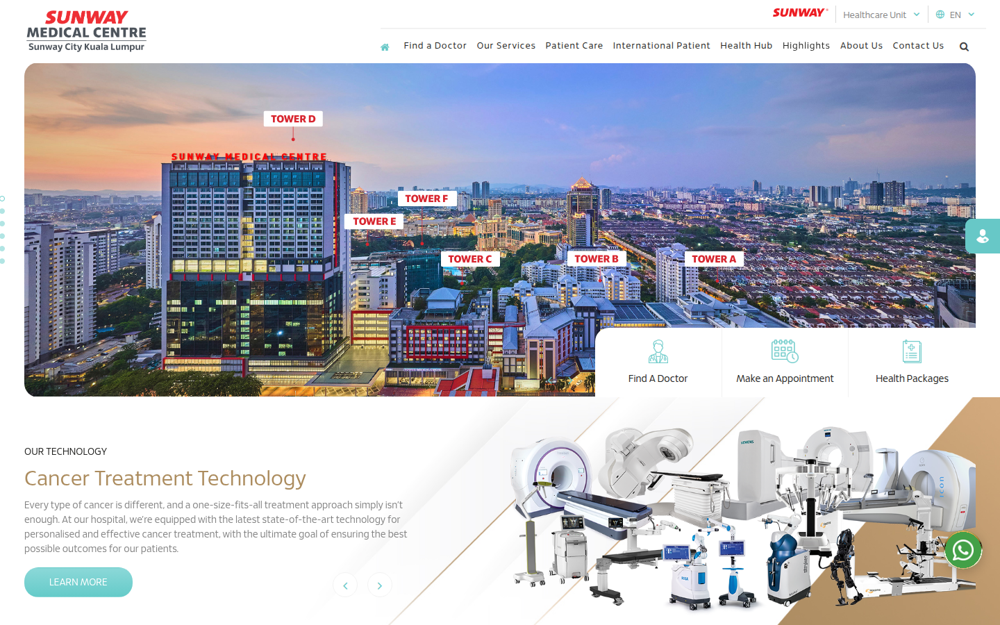
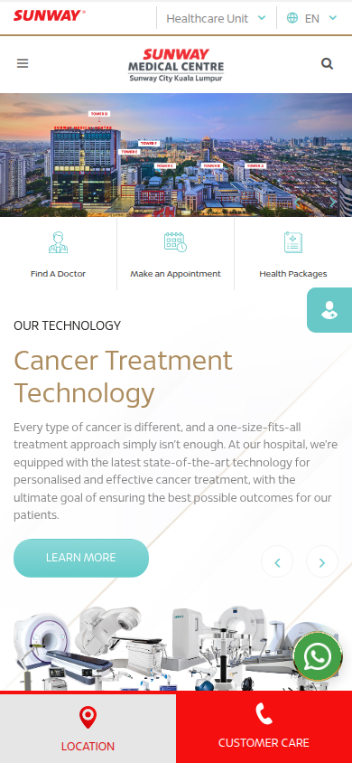

- **Seen:** Red brand wordmark, white nav, teal/turquoise accent (≈`#5BC2CE`, inferred hex).
  Full-width campus photography hero with tower labels — the _building itself_ is the trust object.
  Floating quick-action card row: Find a Doctor / Make an Appointment / Health Packages.
  Sand/bronze secondary palette in the technology section; equipment glamour shots (MRI, robots).
- **Seen (mobile):** sticky bottom bar (Location / Customer Care) in solid red, green WhatsApp FAB.
- **Trust signals:** scale (campus, towers), technology imagery, "Best Hospital in Malaysia" title tag.
- **Accessibility impression:** the pale-teal "LEARN MORE" button with white text visibly fails
  contrast; body grey-on-white is adequate. Dense nav with small hit targets.
- **Reads as:** competent 2018-era hospital-corporate; photography-led, not typography-led.

### Gleneagles Hospitals (IHH) — https://gleneagles.com.my/

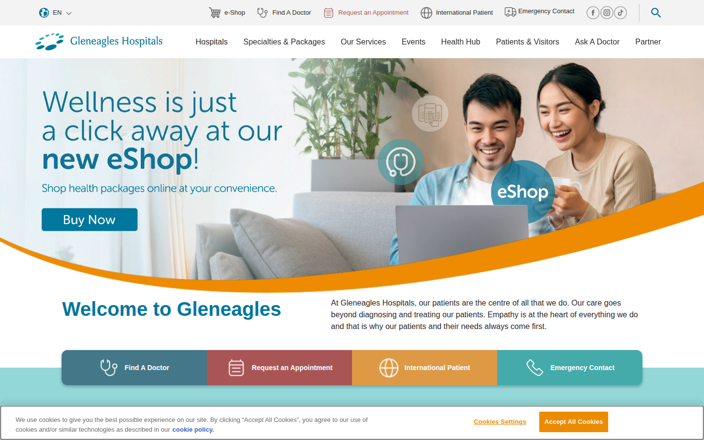

- **Seen:** Teal-blue brand (≈`#0072A5`), signature orange "swoosh" curve dividing hero from body.
  Lifestyle photography of smiling young Malaysians. Utility nav row above main nav (e-Shop,
  Find A Doctor, Request an Appointment, International Patient, Emergency Contact).
  Four-color quick-action bar (slate / maroon / orange / teal) — each action gets its own hue.
- **Trust signals:** IHH group brand, "Empathy" copy, breadth of services; no badges in hero.
- **Reads as:** retail healthcare — the e-Shop banner and orange swoosh push it toward commerce.
  Multi-hue action bars are exactly what a clinical tool should _not_ do (color loses meaning).

### Prince Court Medical Centre — https://princecourt.com/

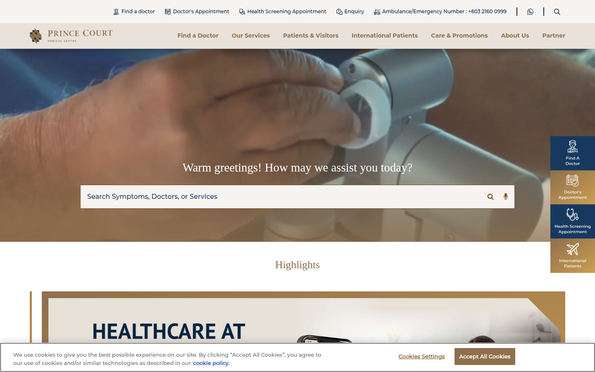

- **Seen:** Gold/bronze + navy palette, serif logotype and serif hero greeting ("Warm greetings!"),
  full-bleed video hero, giant symptom/doctor search bar with mic icon, gold right-rail quick
  actions, ambulance/emergency phone number permanently in the top utility bar.
- **Trust signals:** luxury-hotel language — serif, gold, concierge tone. Emergency number always visible.
- **Reads as:** premium hospitality. Serif + gold reads "expensive," not "clinical software."

### Subang Jaya Medical Centre (Ramsay Sime Darby) — https://subangjayamedicalcentre.com/

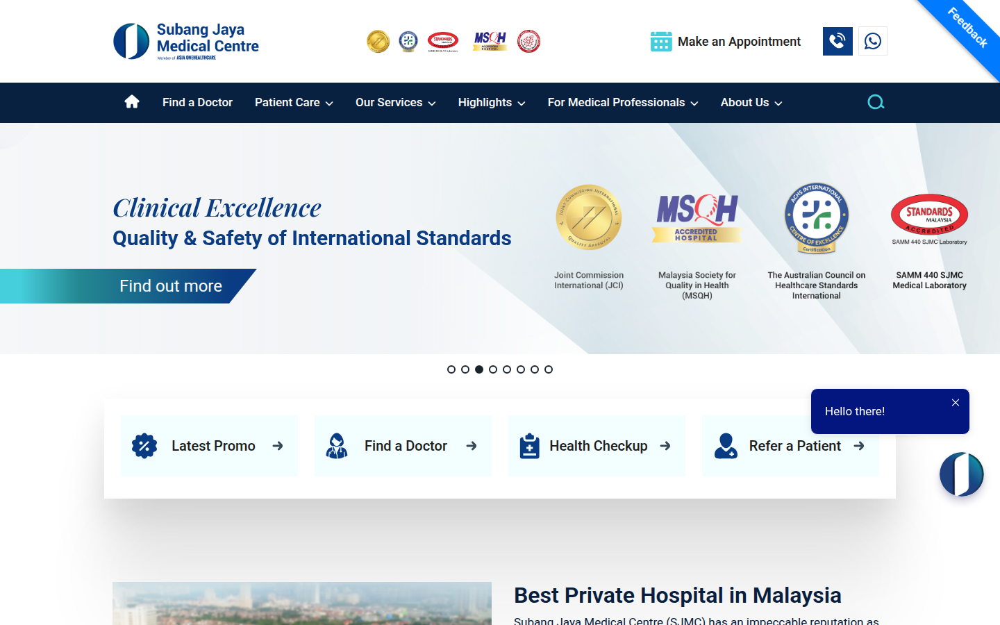

- **Seen:** Navy nav bar, white header with a **row of five accreditation logos** _above the fold_,
  and a hero carousel slide dedicated entirely to accreditation: JCI gold seal, MSQH, ACHS
  International, SAMM 440 lab certification — each named in full. Serif italic "Clinical
  Excellence" headline. Quick-action cards on pale mint (Latest Promo / Find a Doctor / Health
  Checkup / Refer a Patient). WhatsApp + phone icon buttons in the header.
- **Trust signals:** the strongest badge display of any site studied — accreditation _is_ the hero.
- **Reads as:** the Malaysian trust formula stated explicitly: institutional badges + navy +
  appointment CTA + WhatsApp.

### DoctorOnCall — https://www.doctoroncall.com.my/

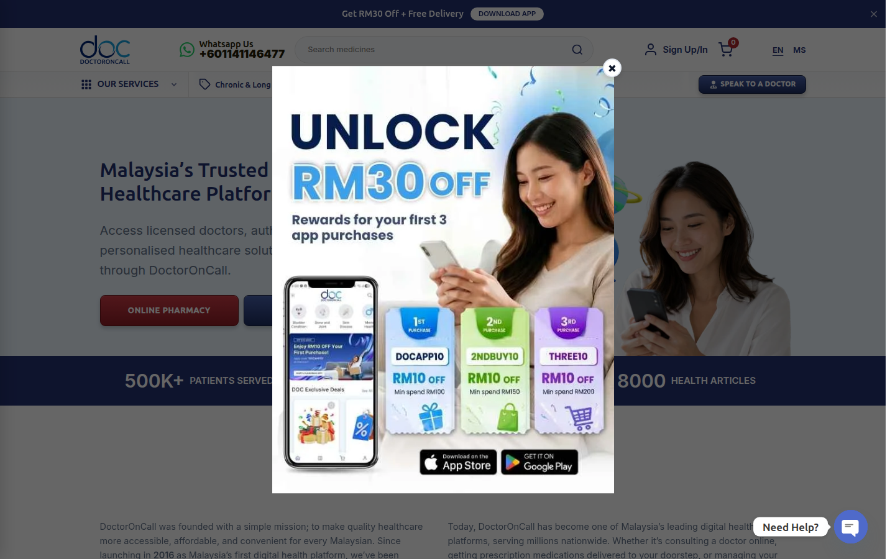

- **Seen:** Promo interstitial ("UNLOCK RM30 OFF") over the page, coupon-code cards, app-store
  badges, WhatsApp number in the header, EN/MS language toggle, stat counters ("500K+ patients
  served", "8000 health articles"), maroon and navy CTAs, "Malaysia's Trusted Healthcare
  Platform" headline.
- **Reads as:** e-commerce first, clinical second. Useful as evidence of local vernacular
  (WhatsApp, bilingual, discount culture) — not as a visual model for a doctor-facing tool.

### Naluri — https://www.naluri.life/

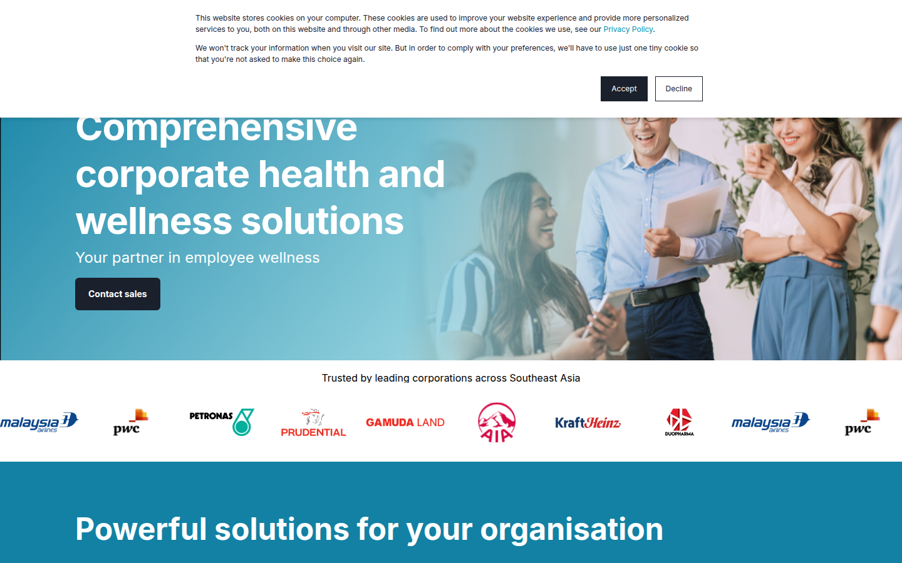

- **Seen:** Teal gradient hero, white grotesque headline, dark near-black CTA button, corporate
  logo strip as the trust block (Petronas, PwC, Prudential, AIA, Malaysia Airlines, Kraft Heinz).
- **Reads as:** the most "modern SaaS" of the Malaysian set — B2B logo-strip trust, restrained
  palette. Shows Malaysian digital health _can_ look like contemporary SaaS.

**Malaysia pattern (synthesis):** trust is signalled by _institutions and access_, not by
minimalism — accreditation badges (SJMC), physical scale (Sunway), always-visible emergency
phone (Prince Court), WhatsApp on every site, bilingual toggles, and appointment CTAs multiplied
in every corner. Palettes cluster on teal/blue + one warm accent (orange/gold/red). Density is
high; whitespace is not treated as a virtue. Nothing observed had a dark mode.

---

## 2. Overseas Institutional

### Cleveland Clinic — https://my.clevelandclinic.org/

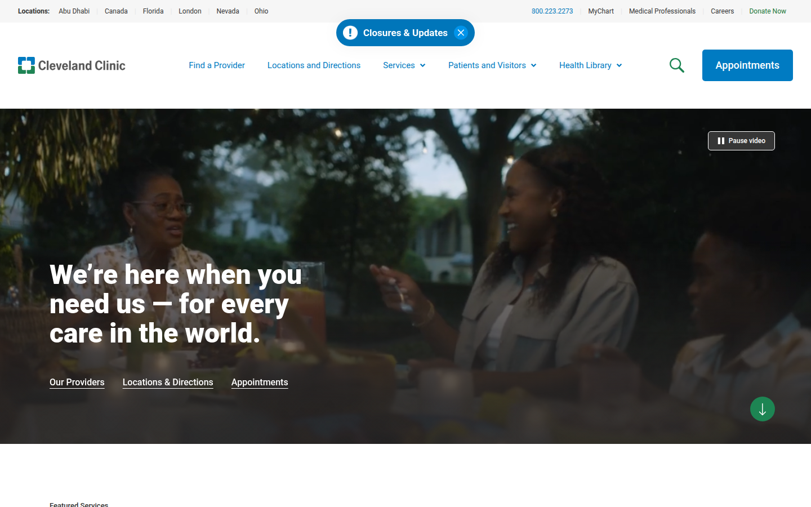

- **Seen:** White nav, one typeface, blue links, a _single_ solid-blue CTA ("Appointments"),
  dimmed full-bleed video hero with a large humanist-sans headline, underlined text links instead
  of secondary buttons, a blue pill alert ("Closures & Updates") with an "!" icon at the very top.
- **Trust signals:** restraint itself — one CTA, one accent color, professional photography,
  locations bar (Abu Dhabi/London/…) implying scale.
- **Reads as:** the modern institutional benchmark: photography + one blue + underlined links.

### Mayo Clinic — https://www.mayoclinic.org/ _(blocked — Akamai "Access Denied")_

- **Inferred:** dark navy-blue (`#003DA5`-family) identity, white content pages, serif/sans mix,
  heavy information hierarchy for conditions content, "top hospital" ranking badges. Not verified
  by screenshot in this pass.

### Johns Hopkins Medicine — https://www.hopkinsmedicine.org/ _(blocked — Cloudflare)_

- **Inferred:** academic navy + white, dense content IA similar to Mayo. Not verified by screenshot.

### NHS.uk — https://www.nhs.uk/

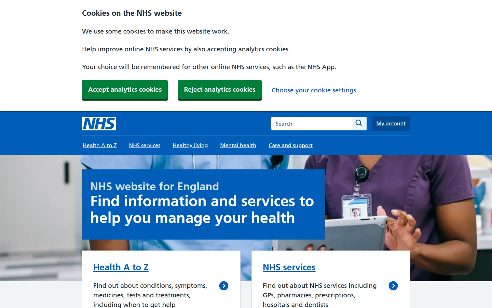
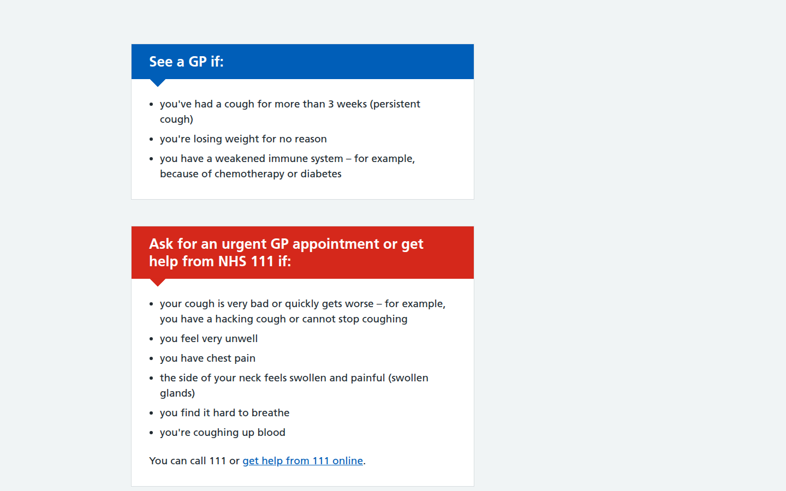
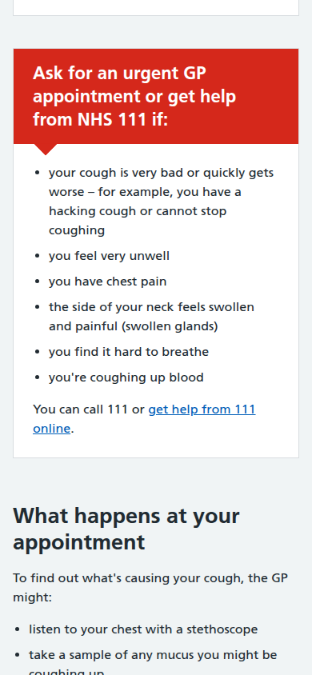

- **Seen (home):** Solid NHS-blue header, white logo block, underlined nav links, green
  action buttons with a darker bottom border (pressable affordance), blue panel overlaying
  photography, card grid with chevron affordances. One typeface (Frutiger, inferred name).
- **Seen (cough symptom page):** the **care-card severity pattern** — a white card whose _header
  bar_ carries the urgency color and whose body stays black-on-white for legibility:
  - "See a GP if:" → **blue** header (non-urgent)
  - "Ask for an urgent GP appointment or get help from NHS 111 if:" → **red** header (urgent)
  - (Emergency "call 999" uses a red-bordered immediate variant — inferred from the design system.)
    Severity is carried by header color + _explicit action wording_, never by tinting the body text.
- **Seen (mobile 390×844):** the urgent card is full-width, text unchanged, targets large. The
  pattern survives small screens with zero loss.
- **Design system evidence** — https://service-manual.nhs.uk/design-system/styles/colour :

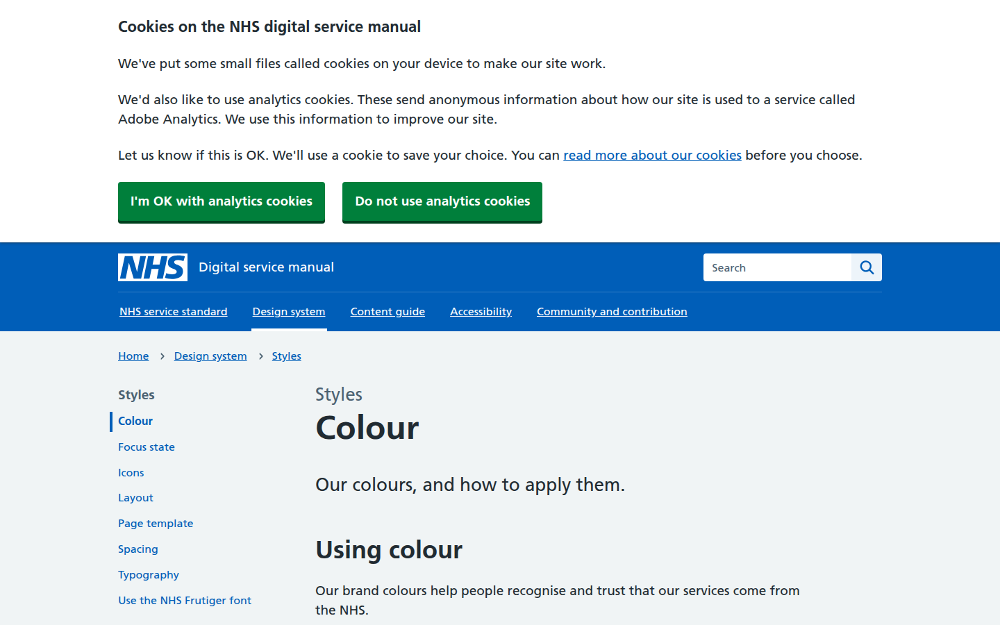
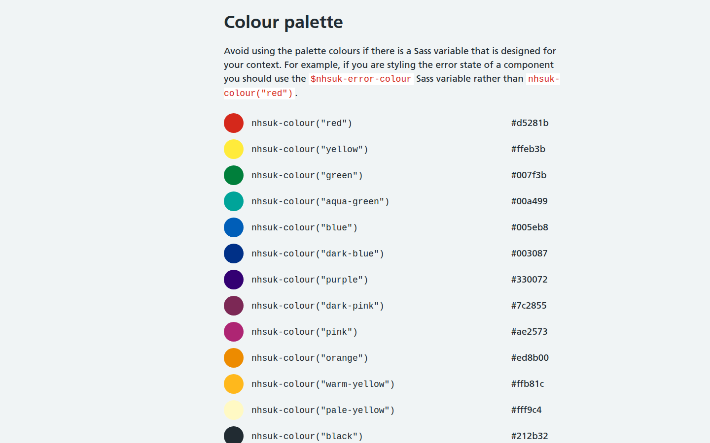

- **Seen (documented hexes):** red `#d5281b`, yellow `#ffeb3b`, green `#007f3b`, aqua-green
  `#00a499`, blue `#005eb8`, dark-blue `#003087`, purple `#330072`, orange `#ed8b00`,
  warm-yellow `#ffb81c`, pale-yellow `#fff9c4`, black `#212b32`. The manual instructs using
  semantic Sass variables (e.g. `$nhsuk-error-colour`) over raw palette colors.
- **Inferred (from the service manual's guidance pages):** WCAG 2.2 AA is the mandated bar;
  focus states are a dedicated style (yellow fill + black bottom border); text on photos is
  banned unless on a solid panel; interactive targets ≥24×24 CSS px (WCAG 2.5.8) with NHS
  components typically far larger; error/urgent information is never conveyed by color alone.

### CMS Design System — https://design.cms.gov/

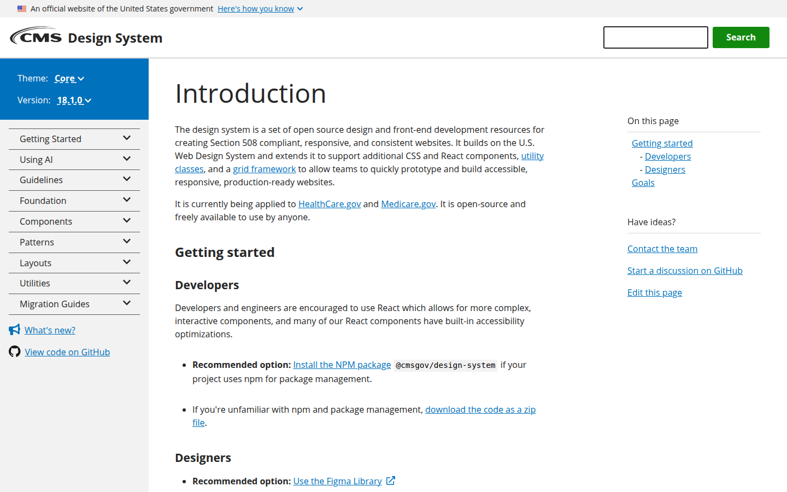

- **Seen:** "Section 508 compliant, responsive, and consistent websites… built on the U.S. Web
  Design System," React components with "built-in accessibility optimizations," applied to
  HealthCare.gov and Medicare.gov. Government-utilitarian chrome: flag banner, green search
  button, blue sidebar.
- **Relevance:** both NHS and CMS converge on the same conclusion — for health, accessibility is
  a _system property_ shipped inside components, not a QA afterthought. CatatMD gets this by
  encoding rules into its Radix-based components once.

---

## 3. Clinician-Facing AI Products (CatatMD's Genre)

### Abridge — https://www.abridge.com/

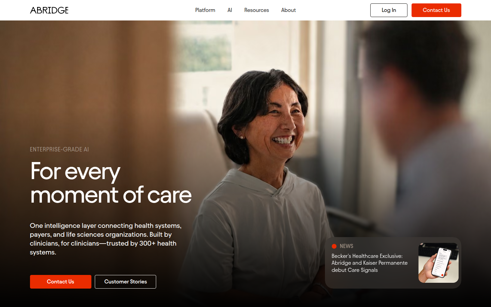
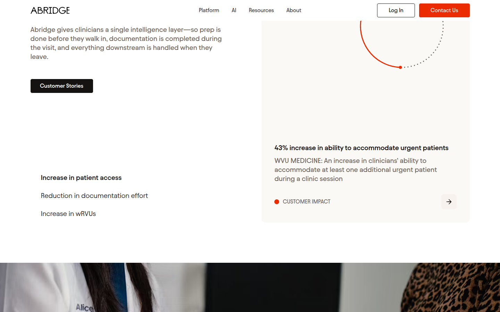

- **Seen:** Warm, cinematic patient photography (browns/creams — _no medical blue anywhere_),
  white wordmark, vermilion accent (≈`#FF3C1F`, inferred) used for exactly one CTA and small
  dot motifs, light-weight grotesque headline ("For every moment of care"), "trusted by 300+
  health systems" claim, news card citing Kaiser Permanente. Below the fold: warm off-white
  (≈`#F7F5F2`) stat cards — "43% increase in ability to accommodate urgent patients" — outcome
  numbers as the trust currency.
- **Reads as:** the premium end of the genre. Editorial warmth + enterprise numbers.

### Heidi Health — https://www.heidihealth.com/ (served `en-my` — has a Malaysian locale)

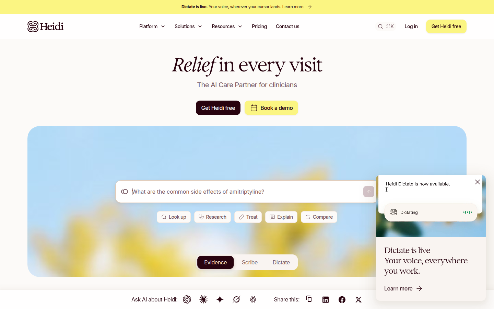

- **Seen:** Cream/off-white ground, near-black aubergine text, serif _italic_ accent word
  ("_Relief_ in every visit"), butter-yellow accent (banner + "Book a demo"), dark pill primary
  CTA, product-first hero: a live query box with chips (Look up / Research / Treat / Explain /
  Compare) and an Evidence/Scribe/Dictate toggle over a soft blurred photo card.
- **Trust signals:** the product itself demoed in the hero; "Ask AI about Heidi" row.
- **Reads as:** friendly-consumer clinical: warm, calm, quietly confident. The serif-accent-word
  - warm-neutral formula is the 2026 genre signature.

### Nabla — https://www.nabla.com/

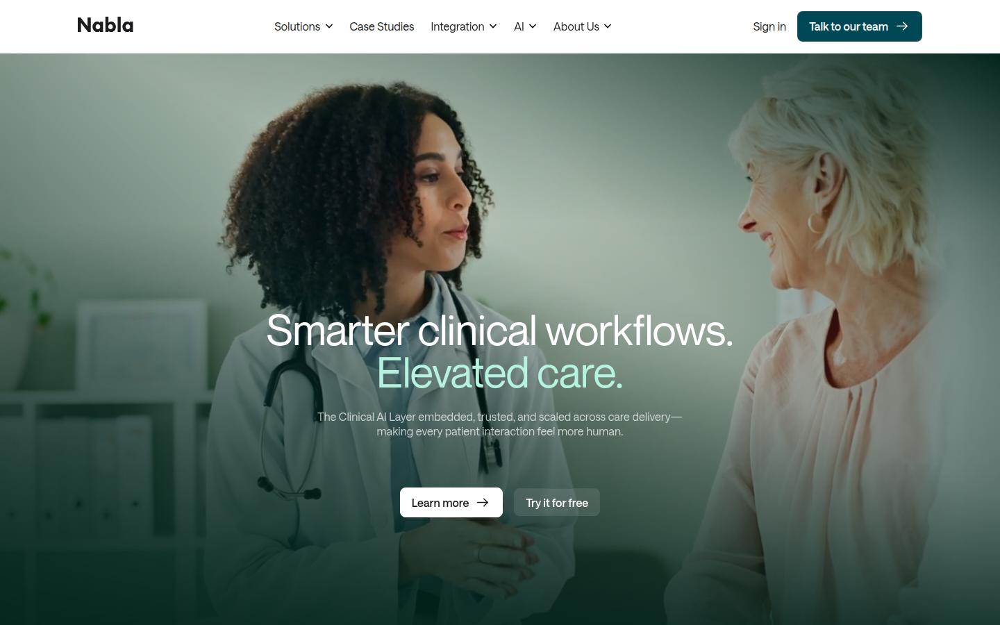

- **Seen:** Deep pine-green-tinted doctor-patient photography, centered grotesque headline with a
  mint-green highlighted line ("Elevated care."), dark green CTA, white pill secondary. Copy
  leads with "embedded, trusted, and scaled."
- **Reads as:** green-family alternative to medical blue; calm, institutional-modern.

### Freed — https://www.getfreed.ai/

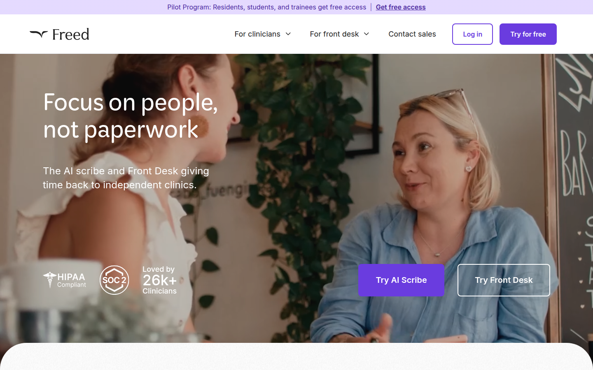

- **Seen:** Violet accent (≈`#6C4CF1`, inferred), warm documentary video still, and — notably —
  **HIPAA Compliant + SOC 2 badges and "Loved by 26k+ clinicians" directly in the hero**,
  lavender announcement banner, white-outline secondary CTA.
- **Reads as:** the compliance-badge-in-hero pattern translated to SaaS; the closest analogue to
  what a Malaysian clinician-facing product should do with PDPA/data-residency claims.

### Corti — https://corti.ai/

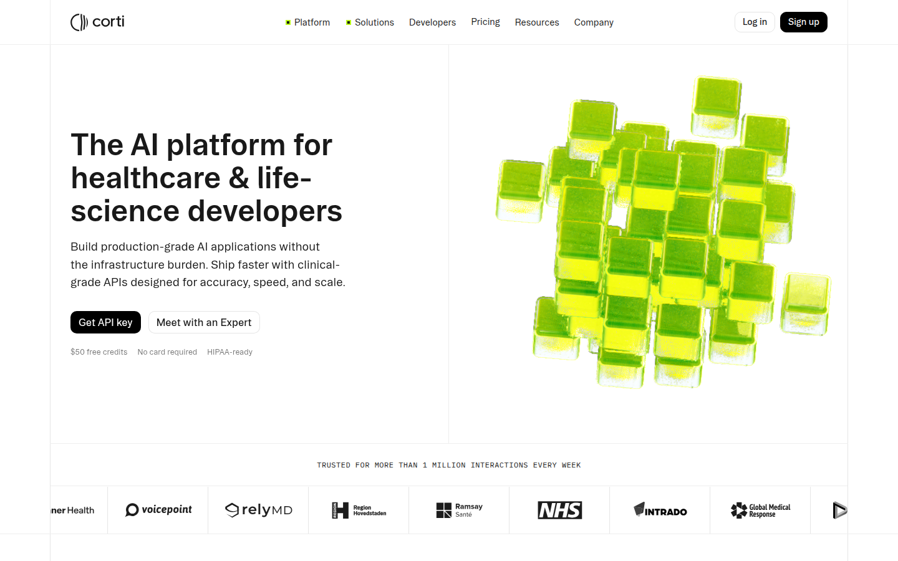

- **Seen:** Monochrome + acid-green 3D render, hairline grid borders, mono-caps microcopy
  ("TRUSTED FOR MORE THAN 1 MILLION INTERACTIONS EVERY WEEK"), logo strip including NHS and
  Ramsay, "HIPAA-ready" microcopy under the CTA.
- **Reads as:** developer-infrastructure aesthetic. Proof that "clinical" and "dev-tool cool"
  are different languages — CatatMD should not sound like this.

### Suki — https://www.suki.ai/

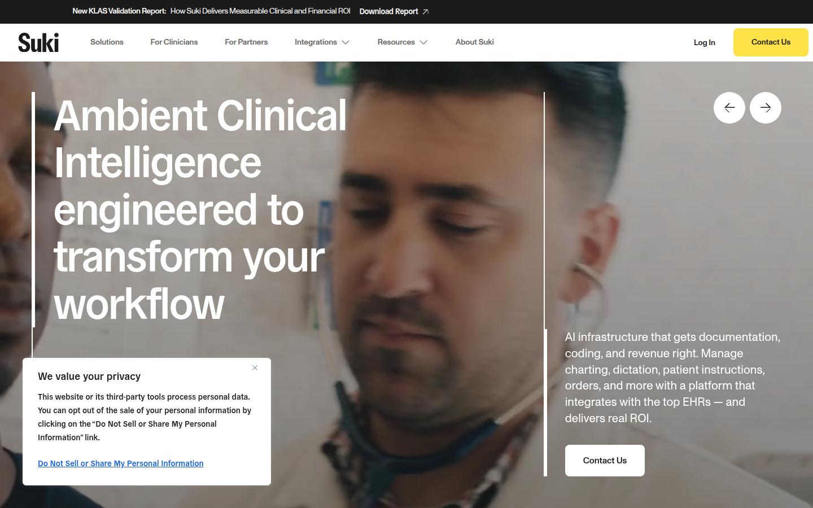

- **Seen:** Black top banner promoting a **KLAS validation report**, yellow CTA, oversized
  grotesque white headline over documentary clinical video, quote-bar layout.
- **Reads as:** enterprise sales-led; third-party validation (KLAS) as the trust object.

### Consumer-Modern Clinics _(One Medical, Carbon Health, Tia, Ro — all bot-blocked)_

- **Inferred:** the consumer-clinic wave popularised warm neutrals, serif accents, and
  photography of real people over stock scrubs — the same moves Heidi/Abridge now use. Their
  influence is already captured through the products above; no screenshots this pass.

---

## 4. Cross-Cutting Patterns (2026)

What modern-and-trustworthy converges on — across Cleveland, NHS, Abridge, Heidi, Nabla, Freed:

1. **One accent color, used scarcely.** The accent marks the single primary action; everything
   else is neutral. (Cleveland's one blue CTA; Abridge's one vermilion button; Heidi's one dark pill.)
2. **Warm neutrals are replacing clinical white-and-blue** in the clinician-SaaS genre: cream,
   off-white, warm grey grounds with near-black ink (Heidi, Abridge). Institutions keep blue;
   products have moved past it.
3. **Serif is an accent, not a body face.** A single italic serif word inside a grotesque headline
   (Heidi) or serif reserved for "excellence" claims (SJMC, Prince Court). Body text is always a
   humanist/neutral sans.
4. **Trust is explicit, not atmospheric:** compliance badges in the hero (Freed), accreditation
   seals as hero content (SJMC), third-party validation reports (Suki), outcome numbers (Abridge),
   named logo strips (Naluri, Corti). Restraint alone (Cleveland) works only when the brand is
   already famous.
5. **Severity has one grammar:** neutral body + colored header/edge + explicit action verb
   (NHS care cards). Nobody who is serious tints whole passages red.
6. **Photography of real people** (patients, clinicians mid-consult) beats illustration and
   iconography everywhere in this space; illustration reads consumer-app, 3D renders read dev-tool.
7. **What reads dated in 2026:** multi-color quick-action bars (Gleneagles), pale-tint buttons
   with white text (Sunway), promo popups and coupon UI (DoctorOnCall), equipment glamour shots,
   carousels, more than two typefaces, WhatsApp FABs on a professional tool.

**Malaysia vs overseas:** Malaysian sites over-signal (badges + phone numbers + WhatsApp +
multiple CTAs + density) because their audience is patients making a high-cost purchase decision;
Western clinician products under-signal visually and over-signal _institutionally_ (compliance
badges, validation reports, outcome stats). CatatMD's audience is Malaysian _doctors_: it should
take the Malaysian instinct for explicit credentials (show the PHI gate, cite MOH/local guideline
IDs, name the data region) but express it with the Western product restraint (one accent, warm
neutrals, generous legibility).

---

## 5. Recommended Direction for CatatMD

### Palette Family

| Role           | Recommendation                       | Example Hexes                       | Rationale                                                                                                                              |
| -------------- | ------------------------------------ | ----------------------------------- | -------------------------------------------------------------------------------------------------------------------------------------- |
| Ground         | Warm off-white / paper               | `#FAF9F7` body, `#FFFFFF` cards     | Genre signature (Heidi/Abridge); calmer than clinical white under long sessions                                                        |
| Ink            | Warm near-black                      | `#1F2421` text, `#5C6560` secondary | NHS-grade contrast (≥7:1 on ground) without pure-black harshness                                                                       |
| Primary accent | Deep clinical teal-green             | `#0F6B5C` (hover `#0A5347`)         | Reads medical in both Malaysian (teal heritage: Sunway/Gleneagles/Naluri) and Western (Nabla) registers; distinct from severity colors |
| Accent usage   | Approve action, active states, links | —                                   | One accent, scarcity rule; the Approve button is the only large filled element on the review screen                                    |

### Severity System (Aligned to Emergency / Urgent / Advisory)

Adopt the NHS care-card grammar: **white card, colored header/left edge, black body text, explicit
action wording, plus an icon + label so color is never the only channel** (WCAG 1.4.1).

| Severity        | Color                                                                                  | Anchor                          | Header Text Treatment                                                 |
| --------------- | -------------------------------------------------------------------------------------- | ------------------------------- | --------------------------------------------------------------------- |
| Emergency       | Red `#D5281B` (NHS red, AA on white at large/bold sizes; use `#B32116` for small text) | Left border 4px + tinted header | White on red header, e.g. "Emergency — advise ED referral now"        |
| Urgent          | Amber `#B85C00` (darkened orange for AA text) with `#ED8B00` edge                      | Left border + header            | Dark ink on pale amber `#FFF4E5`                                      |
| Advisory        | Blue `#005EB8`                                                                         | Left border + header            | White on blue or ink on `#EAF2FA`                                     |
| Resolved / info | Neutral grey edge                                                                      | —                               | De-emphasised, never green (green is reserved for the Approve action) |

Missing-information gaps: dotted amber-neutral outline chips, not alarm colors — a gap is a
prompt, not a warning.

### Typography

- **Body/UI:** one humanist sans with a large x-height and real tabular figures — Inter,
  Source Sans 3, or Public Sans (CMS uses the USWDS family; NHS uses Frutiger). 16px minimum
  body, 14px floor for metadata. Line-height ≥1.5 for note text.
- **Optional accent:** a serif (e.g. Source Serif 4) _only_ for the marketing/login headline —
  one italic accent word maximum, Heidi-style. Never inside the app.
- **No display fonts, no more than two families total.**

### Review-Screen Layout and Density

- Two-pane: SOAP note as the dominant column (≈62%), right rail stacking red flags (always
  first, emergency on top), missing-info gaps, then cited suggestions. Severity must be visible
  without scrolling — the rail orders itself by severity, never chronologically.
- Section rhythm from NHS: clear h2-per-SOAP-section, generous spacing between sections, cards
  only where interaction exists (flags, suggestions); plain text for the note itself.
- The **Approve** action is a single, full-width-of-rail, accent-filled button with a confirm
  step; nothing else on the screen may be a large filled accent element.
- Citations render as guideline-ID chips (monospace or small-caps token) that expand — echoing
  the ID-constrained backend contract in the UI.
- Density target: everything a doctor needs for a 30–60 s review inside one 1440×900 viewport,
  no carousel, no tabs hiding safety content.

### Login / Marketing Surface Tone

- Warm ground, product screenshot or restrained real-clinic photography (not equipment), one
  serif accent word, and a **credential row in the hero**: PHI de-identification gate,
  Singapore data residency, doctor-approves-everything — the Freed/SJMC badge instinct executed
  with SaaS restraint. English UI with Malay-ready strings (DoctorOnCall's EN/MS toggle is the
  local expectation).

### WCAG 2.2 AA Checklist That Matters Most Here

1. Contrast ≥4.5:1 for all text, ≥3:1 for UI borders/icons — verify the severity ramps
   specifically (raw NHS orange/red fail for small text; use darkened variants).
2. Never color-only severity: icon + word label on every flag (1.4.1).
3. Visible focus ring on every interactive element, NHS-style high-contrast (2.4.7 / 2.4.11
   focus-not-obscured); Radix primitives keep focus management — style it loudly.
4. Target size ≥24×24 px for chips, expanders, and edit affordances (2.5.8).
5. Full keyboard path: review → edit gap → acknowledge flag → approve (2.1.1), with a logical
   order matching clinical priority.
6. Approve is a deliberate two-step (3.3.4 error prevention for legal/medical commitments).
7. Status changes (flag acknowledged, note approved) announced via live regions (4.1.3).
8. Text-on-image banned in-app; solid panels only (NHS rule).
9. Reflow to 390px without horizontal scroll — the two-pane collapses to severity-first stack
   (1.4.10).
10. `prefers-reduced-motion` respected; no attention animation on red flags — position and
    color do the work.

---

## 6. What This Changes

This research should seed a future `docs/DESIGN.md` (not created here) as CatatMD's visual spec.
The load-bearing decisions it should carry:

1. **Warm-neutral ground + single deep teal-green accent** — positions CatatMD with the 2026
   clinician-SaaS genre (Heidi/Abridge/Nabla) and away from both hospital-corporate blue and
   chatbot purple; the accent's scarcity is what makes the Approve button unmistakable.
2. **NHS care-card grammar for the three severities** (colored header/edge + icon + explicit
   action wording on a white card, with AA-corrected hexes) — borrowed from the only
   design system in this study with published, WCAG-audited severity conventions for exactly
   our clinical triage levels.
3. **Green is reserved for nothing; the accent is reserved for Approve** — a severity palette
   (red/amber/blue) that never collides with the action palette, so a doctor's eye can resolve
   "danger vs do" preattentively.
4. **One humanist sans in-app; serif only as a marketing accent** — legibility under 30–60 s
   time pressure beats brand expressiveness inside the tool.
5. **Trust is stated, not implied: a credential row (PHI gate, data residency, doctor-in-control)
   on the login/marketing surface** — the SJMC/Freed badge instinct, which matches how Malaysian
   healthcare audiences actually read trustworthiness.
6. **Severity-first right rail ordered emergency → urgent → advisory, visible without scrolling**
   — layout enforces the same "deterministic rules first" hierarchy as the backend.
7. **Citations surface as guideline-ID chips** — making the ID-constrained citation contract
   visible in the UI, which doubles as a differentiator against free-text AI tools.
8. **Accessibility encoded as component defaults** (focus ring, target size, live regions,
   reduced motion), following the NHS/CMS position that WCAG in healthcare is a build-time
   system property — with the ten-point checklist above as the QA gate for UI diffs.
